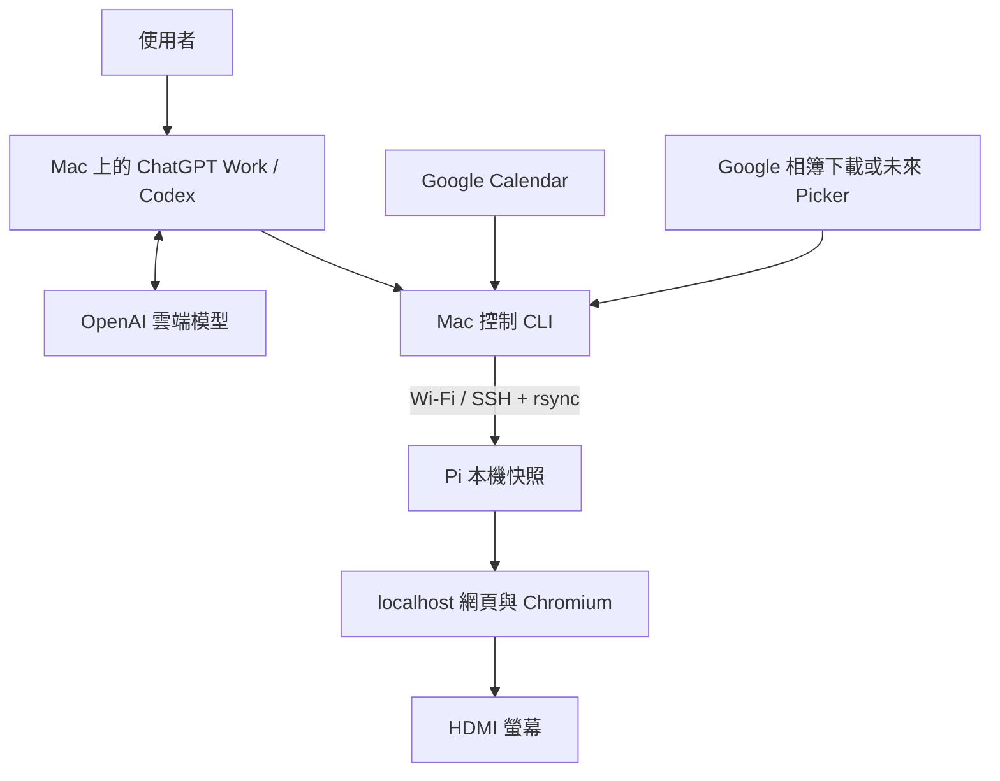

# 架構與實作路線

## 角色分工

| 位置 | 工作 | 不依賴項目 |
|---|---|---|
| Mac mini | Google OAuth、日曆同步、照片整理、SSH 發布、ChatGPT Work／Codex 操作 | 相框換頁不必呼叫 AI |
| Pi 4 | localhost HTTP、Chromium kiosk、本機快取、時鐘／行程／照片顯示 | 斷網或 Mac 休眠仍可播放 |
| Google | 原始相簿、日曆與 OAuth | Pi 不儲存 Google token |
| OpenAI 雲端 | 使用者與 Agent 對話、推理與協助操作 | 模型權重不在 Mac mini 執行 |

## v0.1 設計選擇

- 純 HTML/CSS/JS，不用 CDN 或遠端 iframe，不把 Google 登入頁直接當看板。
- Python 標準庫核心；Google Calendar SDK 是 Mac 選用依賴。
- 只有 localhost HTTP GET 靜態顯示，沒有可被 LAN 呼叫的任意命令端點。
- 使用者透過 Mac 上具本機 terminal 權限的 Agent 下指令；一般網頁版對話不等於已能 SSH 到家裡。
- v0.1 是「Agent + CLI」管理架構。不是自動收聽語音，也不是把 ChatGPT App 當成公開後端 API。
- 如需手機／Pi 主動詢問 AI 的常駐 API，v0.3 另建 Mac service + 正式 OpenAI API，獨立計費與憑證管理；不轉用 ChatGPT session token。

## 資料與部署

`data/state.json` 欄位：mode、interval（5–3600 秒）、fit、timezone、message、photos（相對路徑）、events（title/start/end）、calendar_updated_at。

流程：Google／本機資料 → Mac data → 臨時完整 build → rsync 新 release → Pi 上原子切換 runtime/current。HTTP server 跟隨 symlink，既有服務不用重啟。

每次操作 CLI 是單一 writer；不要平行執行兩個設定／同步作業。v0.2 加鎖與操作佇列後再開多使用者控制。

失敗策略：

| 失敗 | 行為 |
|---|---|
| Google 授權失效 | 同步報錯，保留上一份完整日曆 |
| SSH / rsync 中斷 | current 不切換；可能留有未完成 release，人工清理 |
| Mac 睡眠 | Pi 本機資料持續播放；顯示最後更新時間 |
| Chromium crash | kiosk 腳本重開 Chromium |
| HTTP server crash | systemd restart |
| Pi 斷電 | 下次開機由桌面登入與服務恢復；SD 損壞不能靠軟體保證恢復 |

離線不代表資料永遠有效；過期行程不顯示，未來行程只有最近一次抓取的七天範圍。第一次沒有快取會顯示「日曆尚未同步」。照片只同步本人指定的集合。

## 分期施工（估計投入，不含硬體等待）

| 階段 | 交付／驗收 | 估計 |
|---|---|---|
| P0 硬體與 SSH | 螢幕顯示、Wi-Fi、key 登入 | 0.5 天 |
| P1 v0.1 本機相框 | 20 張照片、開機 kiosk、斷網續播 | 0.5–1 天 |
| P2 日曆與控制 | Google OAuth、多日曆、模式／留言、回滾 | 0.5–1 天 |
| P3 v0.2 Picker | 選照、分頁、下載、容量、刪除、重新選取 | 1–2 天 |
| P4 v0.2 運維 | launchd 同步、互斥鎖、去重快照、磁碟容量門檻 | 0.5–1 天 |
| P5 v0.3 智慧互動 | 語音／手機、正式 API、受限工具、操作紀錄 | 按需求估算 |

後續功能優先序：排程開關螢幕 → 天氣／家庭提醒 → 語音 → 感測有人才亮屏。HDMI 省電與旋轉要依實機 compositor / 螢幕能力驗證；暫不納入 v0.1 完成項。
